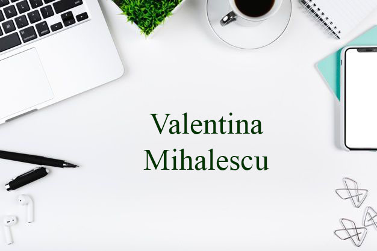

	

	
	
	

## 👨🏻‍💻 &nbsp;About Me:

🗯️ &nbsp;I’m currently looking for an internship role as a Software Developer.

❄️ &nbsp;I’m currently working on developing my knowledge in Software Engineering, Machine Learning and Cloud Computing

🎓 &nbsp;I'm currently a second year undergraduate studying Computer Science at <a href = "https://www.cs.ubbcluj.ro"</a>Babeș Bolyai University of Cluj Napoca

💡 &nbsp;I like to solve algorithmic problems or work on side project during my free time.

🌱 &nbsp;I'm on track for learning more about AI, AWS, and get into Open Source.

💬 &nbsp;Feel free to reach out to me for work opportunities or working alogside a project.

 

## 🛠 &nbsp;Tech Stack:

### 💻 &nbsp;Languages:

&nbsp;
&nbsp;
&nbsp;
&nbsp;

